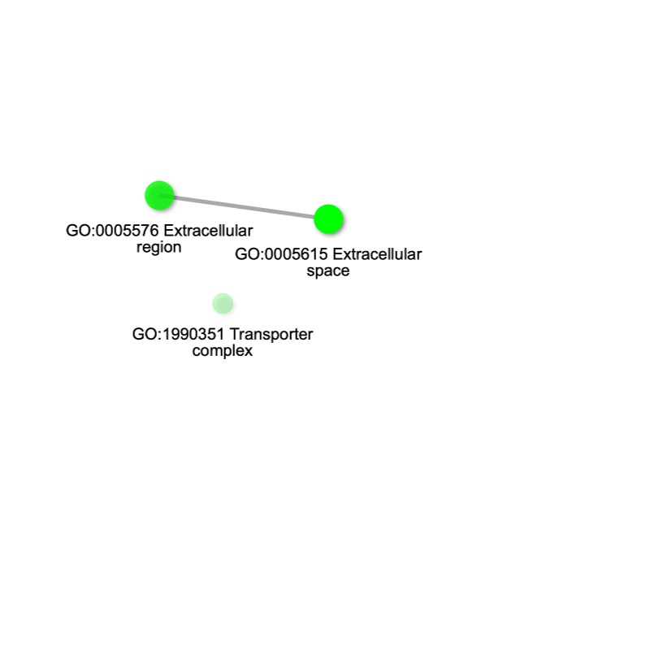
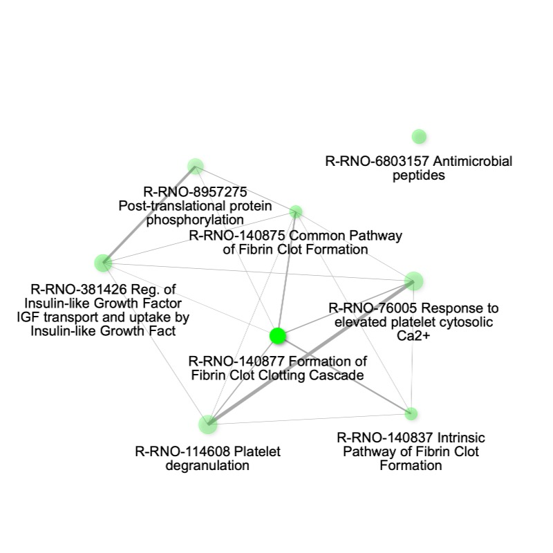
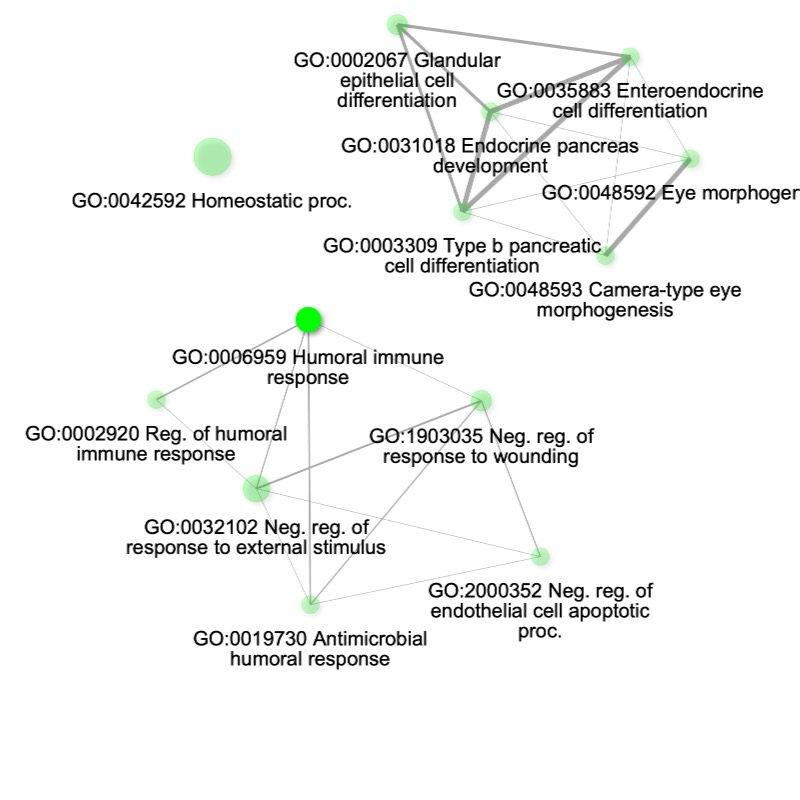
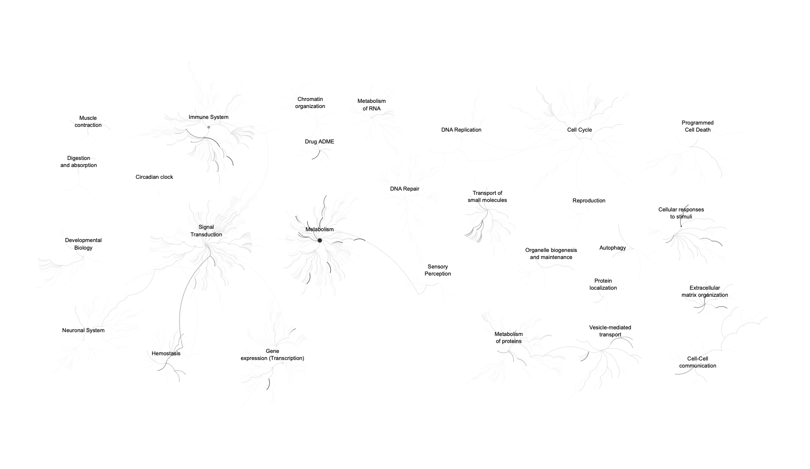
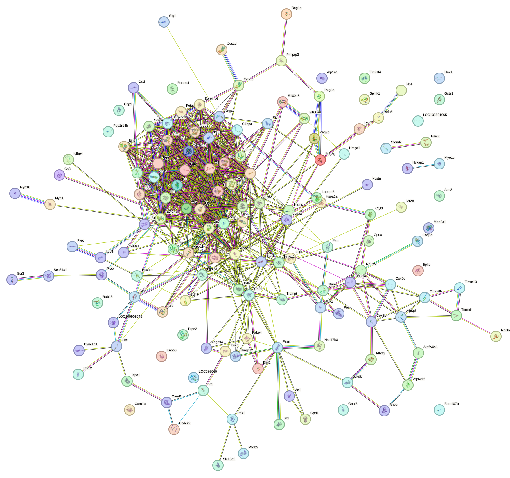

```{r setup, include=FALSE}
knitr::opts_chunk$set(echo = TRUE)
library(readr)
library(dplyr)
library(tidyr)
library(ggplot2)
library(pheatmap)
library(limma)
library(ggrepel)
```

2.3
```{r load}
proteins <- read_tsv('output/combined_protein.tsv')
colnames(proteins) <- trimws(colnames(proteins))
```

2.4
```{r DataFiltration}
intensity_cols <- c(
  "RAT_NP_1 Intensity",
  "RAT_NP_2 Intensity",
  "RAT_NP_3 Intensity",
  "RAT_SP_1 Intensity",
  "RAT_SP_2 Intensity",
  "RAT_SP_3 Intensity"
)

#remove all rows with zero intensity in all samples
proteins <- proteins[rowSums(proteins[, intensity_cols] != 0, na.rm = TRUE) > 0, ]

# remove non-rat proteins
proteins <- proteins %>% filter(Organism == 'Rattus norvegicus')
```

```{r DataTransformation&Normalization}
# log transform all intensity columns
proteins <- proteins %>%
  mutate(
    across(
      all_of(intensity_cols),
      ~ log2(na_if(., 0)),
      .names = "{.col}_log"
    )
  )

#plotting log transformed and raw data

# reshape raw data
raw_long <- proteins %>%
  select(all_of(intensity_cols)) %>%
  pivot_longer(
    cols = everything(),
    names_to = "Sample",
    values_to = "Intensity"
  )

# reshape log2 data
log_long <- proteins %>%
  select(ends_with("_log")) %>%
  pivot_longer(
    cols = everything(),
    names_to = "Sample",
    values_to = "Intensity"
  )

# plot
ggplot() +
  geom_histogram(
    data = raw_long,
    aes(x = Intensity),
    bins = 50,
    alpha = 0.6
  ) +
  geom_histogram(
    data = log_long,
    aes(x = Intensity),
    bins = 50,
    alpha = 0.6
  ) +
  facet_wrap(~Sample, scales = "free") +
  labs(
    title = "Intensity Distributions Before and After log2 Transformation",
    x = "Value",
    y = "Count"
  )

log_cols <- paste0(intensity_cols, "_log")

#compute medians
sample_medians <- sapply(proteins[log_cols], median, na.rm = TRUE)

# global median across all samples
global_median <- median(sample_medians, na.rm = TRUE)

# normalize columns
for (col in log_cols) {
  new_col <- paste0(col, "_mednorm")
  proteins[[new_col]] <- proteins[[col]] - sample_medians[col] + global_median
}
```

```{r DataImputation}
log_norm_cols <- grep("_log_mednorm$", colnames(proteins), value = TRUE)

#MNAR left-censored imputation
set.seed(123)  # for reproducibility

impute_left_censored <- function(x, downshift = 1.8, width = 0.3) {
  mu <- mean(x, na.rm = TRUE)
  sigma <- sd(x, na.rm = TRUE)
  
  # parameters of left-censored normal
  imp_mean <- mu - downshift * sigma
  imp_sd   <- sigma * width
  
  n_miss <- sum(is.na(x))
  if (n_miss > 0) {
    x[is.na(x)] <- rnorm(n_miss, mean = imp_mean, sd = imp_sd)
  }
  
  x
}

# apply imputation column-wise
for (col in log_norm_cols) {
  proteins[[paste0(col, "_imputed")]] <-
    impute_left_censored(proteins[[col]])
}
```

```{r QC&Viz}
qc_cols <- grep("_log_mednorm_imputed$", colnames(proteins), value = TRUE)

expr_mat <- as.matrix(proteins[, qc_cols])
rownames(expr_mat) <- proteins$`Protein ID`  

#center features
expr_mat_scaled <- t(scale(t(expr_mat), center = TRUE, scale = FALSE))

#run principle component analysis
pca <- prcomp(t(expr_mat_scaled), center = TRUE, scale. = FALSE)

#variance 
percent_var <- round(100 * pca$sdev^2 / sum(pca$sdev^2), 1)

#pca plot 

pca_df <- data.frame(
  Sample = rownames(pca$x),
  PC1 = pca$x[, 1],
  PC2 = pca$x[, 2]
)

ggplot(pca_df, aes(x = PC1, y = PC2, label = Sample)) +
  geom_point(size = 3) +
  geom_text(vjust = -0.8, size = 3) +
  labs(
    title = "PCA of Proteomics Data (QC)",
    x = paste0("PC1 (", percent_var[1], "%)"),
    y = paste0("PC2 (", percent_var[2], "%)")
  ) +
  theme_minimal()

#heatmap
sample_cor <- cor(expr_mat, use = "pairwise.complete.obs", method = "pearson")

pheatmap(
  sample_cor,
  clustering_distance_rows = "euclidean",
  clustering_distance_cols = "euclidean",
  clustering_method = "complete",
  main = "Sample–Sample Correlation Heatmap"
)

# select top 500 most variable proteins
vars <- apply(expr_mat, 1, var, na.rm = TRUE)
top_idx <- order(vars, decreasing = TRUE)[1:500]

pheatmap(
  expr_mat[top_idx, ],
  show_rownames = FALSE,
  scale = "row",
  clustering_distance_rows = "euclidean",
  clustering_distance_cols = "euclidean",
  clustering_method = "complete",
  main = "Top 500 Most Variable Proteins"
)
```

2.5
```{r limma}
test_cols <- grep("_log_mednorm_imputed$", colnames(proteins), value = TRUE)

np_cols <- grep("RAT_NP_", test_cols, value = TRUE)
sp_cols <- grep("RAT_SP_", test_cols, value = TRUE)


#limma test
group <- factor(c(
  rep("NP", length(np_cols)),
  rep("SP", length(sp_cols))
))

design <- model.matrix(~ group)

fit <- lmFit(expr_mat[, c(np_cols, sp_cols)], design)
fit <- eBayes(fit)

limma_res <- topTable(
  fit,
  coef = "groupSP",
  number = Inf,
  sort.by = "none"
)

limma_res$`Protein ID` <- rownames(limma_res)

proteins <- proteins %>%
  left_join(
    limma_res[, c("Protein ID", "logFC", "P.Value", "adj.P.Val")],
    by = "Protein ID"
  )
```

```{r MultTestCorr}
proteins$adj.P.Val <- p.adjust(proteins$P.Value, method = "BH")
```

```{r IdDEP}

logfc_cutoff <- 1.5
alpha <- 0.05

proteins <- proteins %>%
  dplyr::mutate(
    DEP = case_when(
      adj.P.Val < alpha & logFC >=  logfc_cutoff  ~ "Upregulated (SP)",
      adj.P.Val < alpha & logFC <= -logfc_cutoff  ~ "Downregulated (SP)",
      TRUE                                        ~ "Not significant"
    )
  )

DEP_table <- proteins %>%
  dplyr::filter(DEP != "Not significant") %>%
  dplyr::select(
    `Protein ID`,
    logFC,
    P.Value,
    adj.P.Val,
    DEP
  ) %>%
  arrange(adj.P.Val)

nrow(DEP_table)
```

```{r volcano}

ggplot(proteins, aes(x = logFC, y = -log10(P.Value))) +
  geom_point(
    aes(color = DEP),
    alpha = 0.7,
    size = 1.8
  ) +
  scale_color_manual(
    values = c(
      "Upregulated (SP)"   = "#D62728",
      "Downregulated (SP)" = "#1F77B4",
      "Not significant"    = "grey70"
    )
  ) +
  geom_vline(
    xintercept = c(-logfc_cutoff, logfc_cutoff),
    linetype = "dashed",
    linewidth = 0.6
  ) +
  geom_hline(
    yintercept = -log10(alpha),
    linetype = "dashed",
    linewidth = 0.6
  ) +
  labs(
    title = "Volcano Plot: Differential Protein Abundance (SP vs NP)",
    x = "log2 Fold Change (SP − NP)",
    y = "-log10(p-value)",
    color = "Status"
  ) +
  theme_minimal(base_size = 12)


top_hits <- DEP_table %>% head(10)

ggplot(proteins, aes(x = logFC, y = -log10(P.Value))) +
  geom_point(aes(color = DEP), alpha = 0.6) +
  geom_text_repel(
    data = top_hits,
    aes(label = `Protein ID`),
    size = 3
  ) +
  geom_vline(xintercept = c(-logfc_cutoff, logfc_cutoff), linetype = "dashed") +
  geom_hline(yintercept = -log10(alpha), linetype = "dashed") +
  theme_minimal()
```

```{r export, eval=FALSE}
dep <- DEP_table
id_col <- "Protein ID"

dep_ids <- dep[[id_col]] |> unique() |> na.omit()

# Background = all proteins measured (not just DEPs)
bg_ids <- proteins[[id_col]] |> unique() |> na.omit()

length(dep_ids)
length(bg_ids)

writeLines(dep_ids, "DEP_ids.txt")
writeLines(bg_ids,  "Background_ids.txt")
```

2.6
a) Using ShinyGO, we can visualize the Cellular Components, Molecular Functions, and Biological Processes that are overrepresented in the list of DEPs when compared to the proteome.   

When looking at cellular components, we see overrepresentation in extracellular components.
 

When looking at molecular function, we see overrepresentation in DEPs related to fibrin clot formation and platelet degranulation.
 

And when looking at biological processes, we see two large groupings of overrepresented processes; immune/hummoral response and cell differentiation especially in the pancreas.


b) Using Reactome we can map the DEPs to known rat biological pathways. We can identify affected cellular mechanisms in our samples; the immune system, signal transduction, drug ADME, metabolism, transport of small molecules, cellular response to stimuli, homeostasis, etc. 



c) Using the STRING database we can investigate potential functional relationships between DEPs. We see that the DEPs in our sample have significantly more interactions than expected given a random subset of the proteome. According to STRING our DEPs share 680 interactions, compared to the 118 expected given 145 proteins. This indicates that the DEPs are biologically linked.  



d) According to our analyses, we have been able to identify 145 proteins that are differentially expressed in rats with pancreatitis. Many of these proteins are involved to the immune response to this condition, with many overrepresented biological processes related to immune response, molecular functions relating to blood clotting, and cellular components that are extracellular (likely secretions into the blood). This is consistent with an attempt to fight the disease. We also see biological processes related to pancreatic cell differentiation and development, perhaps indicating the body attempting to regenerate damaged tissue. These GO terms are consistent with the condition of the test subjects, indicating that there is a measurable difference in protein expression in rats with pancreatitis.


